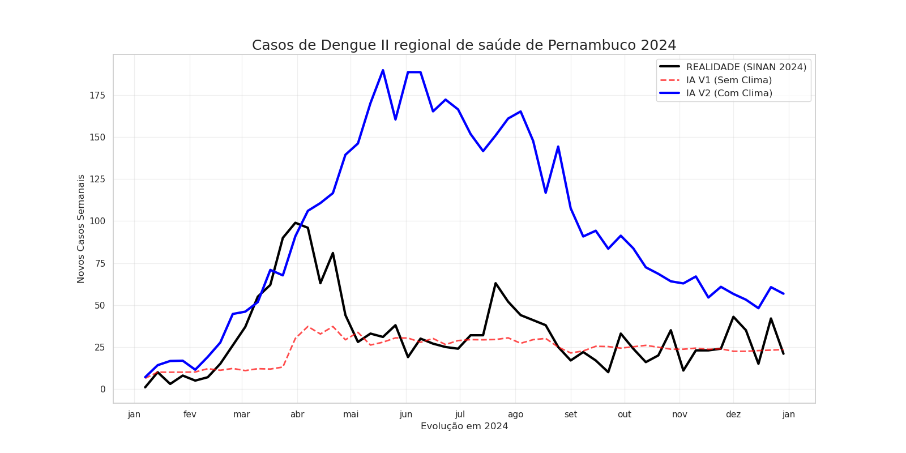

🦟 Dengue Radar AI: Monitoramento e Previsão Epidemiológica (II GERES - PE)

Um pipeline de Engenharia de Dados e Machine Learning End-to-End para prever o risco biológico de surtos de arboviroses usando dados públicos do SUS e Open-Meteo.

🎯 O Problema de Negócio

A gestão de saúde pública enfrenta dificuldades para alocar recursos preventivos (leitos, fumacê, agentes) sem uma visão clara da demanda futura. Os dados do SINAN (DATASUS) chegam com atraso e muitas vezes refletem o passado, não o risco futuro.

O Objetivo: Criar um sistema capaz de prever o Potencial Biológico de Surto com base no clima e histórico, permitindo que gestores atuem antes que os casos lotem os hospitais.

🏗️ Arquitetura da Solução

O projeto foi desenvolvido focando em escalabilidade e eficiência de memória (processamento de gigabytes de dados em hardware limitado).

Ingestão de Dados (ETL):

Coleta automatizada do FTP do DATASUS usando a biblioteca PySUS.

Pipeline de processamento em streaming (chunks) para lidar com arquivos anuais massivos (>1GB) sem estourar a RAM.

Enriquecimento com dados climáticos históricos (1940-2024) via API Open-Meteo, com granularidade municipal.

Engenharia de Features:

Lags Biológicos: Criação de variáveis que respeitam o ciclo do vetor (ex: Chuva há 4 semanas, Temperatura há 3 semanas).

Sazonalidade: Transformações cíclicas (Seno/Cosseno) para capturar o padrão anual da doença.

Modelagem Híbrida (Machine Learning):

Algoritmo: XGBoost Regressor.

V1 (Baseline): Modelo puramente histórico (autoregressivo).

V2 (Final): Modelo Híbrido (Histórico + Clima), capaz de capturar o impacto de fenômenos como o El Niño.

📊 Resultados e o "Delta da Eficiência"

O modelo foi submetido a um teste cego, prevendo o ano de 2024 sem ter visto esses dados durante o treinamento.

🩺 Diagnóstico de Impacto (2024):

🔵 Linha Azul (IA com Clima): Mostra o Risco Biológico. Com o calor e chuva do El Niño em 2024, o modelo previu um cenário catastrófico (~200 casos/semana no pico).

⚫ Linha Preta (Realidade): Mostra que o surto começou a subir junto com a previsão, mas foi "cortado" bruscamente em Abril/Maio.

Conclusão de Negócio:
A diferença entre a curva prevista (o que o clima causaria) e a curva real (o que aconteceu) não é um erro do modelo, mas uma métrica de Sucesso da Gestão. Ela representa os casos evitados pela atuação das equipes de controle (ACE/Fumacê) e a barreira da imunidade de rebanho. O modelo provou ser eficaz para alertar sobre o Potencial Máximo do Surto, servindo como gatilho para ações preventivas.

🛠️ Tecnologias Utilizadas

Linguagem: Python

Engenharia de Dados: Pandas, PyArrow, PySUS, Open-Meteo API.

Machine Learning: XGBoost, Scikit-Learn.

Visualização: Matplotlib, Seaborn, Plotly, Streamlit (Dashboard).

🚀 Como Executar

Clone o repositório:

git clone [https://github.com/paraujo2070/projeto_dengue_pe.git](https://github.com/paraujo2070/projeto_dengue_pe.git)

Instale as dependências:

pip install -r requirements.txt

Execute o Dashboard:

streamlit run app.py

👨‍💻 Autor

Pedro Araújo
Cientista da Computação | Engenharia de Dados & Analytics